# Business Digital Audit Tool

A production-ready Flask web application that audits a business website and presents the results in a modern browser dashboard. The app checks SEO, technical basics, social presence, contact readiness, and conversion readiness, then generates both HTML and TXT reports.

## Features

- Browser-based Flask application, not a terminal tool.
- Professional Bootstrap 5 dashboard with cards, badges, progress bars, icons, shadows, hover states, and responsive layouts.
- User-friendly error pages for invalid URLs, unreachable websites, timeouts, blocked requests, SSL errors, 404 pages, and server errors.
- Category-wise scoring out of 100:
  - SEO: 30
  - Technical Basics: 25
  - Social Presence: 15
  - Contact Readiness: 15
  - Conversion Readiness: 15
- Audit coverage includes:
  - Website reachability
  - HTTP status code
  - HTTPS
  - Response time
  - Page title
  - Meta description
  - H1 tag
  - Images without ALT text
  - Social media links
  - Email detection
  - Phone number detection
  - `robots.txt`
  - `sitemap.xml`
  - Open Graph tags
  - Mobile viewport tag
  - Canonical tag
  - Favicon
  - Broken images sampling
  - Basic security headers
  - Contact form detection
  - CTA, newsletter, and contact page detection
- Automatically generated recommendations based on failed checks.
- Report exports:
  - saved timestamped HTML reports in `reports/`
  - saved timestamped TXT reports in `reports/`
- Audit history stored in SQLite with business name, site, score, timestamp, and filenames.

## Scoring Logic

The audit score is divided into five categories:

- SEO
- Technical Basics
- Contact Readiness
- Social Presence
- Conversion Readiness

Each individual check contributes points to its category. Passing checks add their configured points, while missing checks do not. The final score is calculated by summing all earned points across categories and comparing them against the maximum available score of 100.

## Security

The application validates every submitted URL before any outbound HTTP request is made. Blocked targets include localhost, private IP ranges, loopback addresses, internal networks, file URLs, data URLs, ftp URLs, javascript URLs, and unsafe redirects. These protections reduce the risk of Server-Side Request Forgery (SSRF) by preventing the audit engine from reaching internal services or other unsafe destinations.

## Development Notes

The core Flask application, audit engine, SQLite history storage, report generation, and Bootstrap-based UI were implemented by me. Some debugging, documentation improvements, UI refinements, and code suggestions were assisted by AI coding tools. I reviewed, integrated, tested, and validated every change before finalizing the project.

## Folder Structure

```text
business-digital-audit-tool/
|-- app.py
|-- audit.py
|-- utils.py
|-- report.py
|-- wsgi.py
|-- requirements.txt
|-- README.md
|-- .gitignore
|-- LICENSE
|-- templates/
|   |-- index.html
|   |-- report.html
|   `-- error.html
|-- static/
|   |-- style.css
|   |-- script.js
|   `-- images/
|-- reports/
|   |-- report.html
|   `-- report.txt
`-- screenshots/
```

## Technology Stack

- Python 3
- Flask
- Requests
- BeautifulSoup4
- Jinja2
- HTML5
- CSS3
- Bootstrap 5
- JavaScript

## Installation

1. Clone the repository.

```powershell
git clone https://github.com/Bincy3/business-digital-audit-tool.git
cd business-digital-audit-tool
```

2. Create and activate a virtual environment.

```powershell
python -m venv .venv
.\.venv\Scripts\Activate.ps1
```

3. Install dependencies.

```powershell
pip install -r requirements.txt
```

## Requirements

- Python 3.10 or newer recommended
- Internet access for auditing public websites
- A modern browser

## Usage

1. Start the app for local development.

```powershell
python app.py
```

2. Open the app in a browser.

```text
http://127.0.0.1:5000
```

3. Enter:

- Business Name
- Industry
- Website URL

4. Click **Generate Audit**.

5. Review the dashboard and generated reports:

- `reports/report.html`
- `reports/report.txt`

## Production Run

For a production-style run, use Waitress instead of Flask's built-in development server.

```powershell
waitress-serve --listen=0.0.0.0:8000 wsgi:application
```

Then open:

```text
http://127.0.0.1:8000
```

The `python app.py` command defaults to debug mode off. To enable debug only during development:

```powershell
$env:FLASK_DEBUG="1"
python app.py
```

## Screenshots

### Home Page
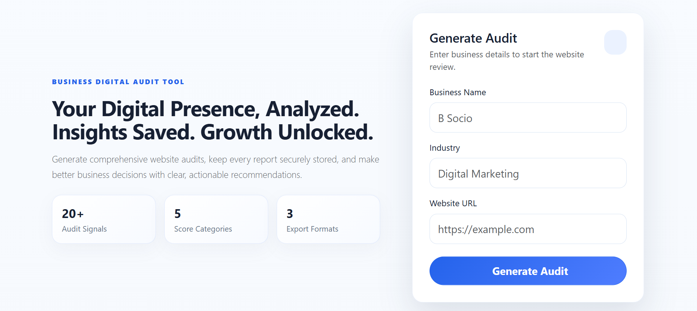

### About Page
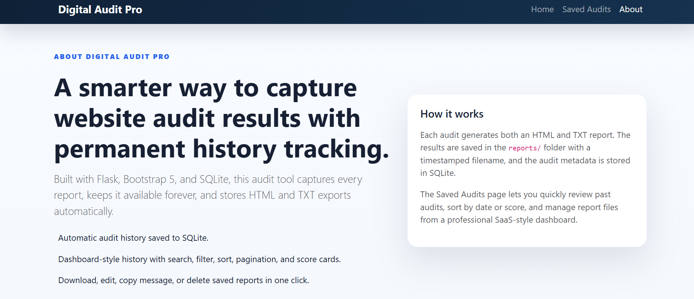

### Generate Audit
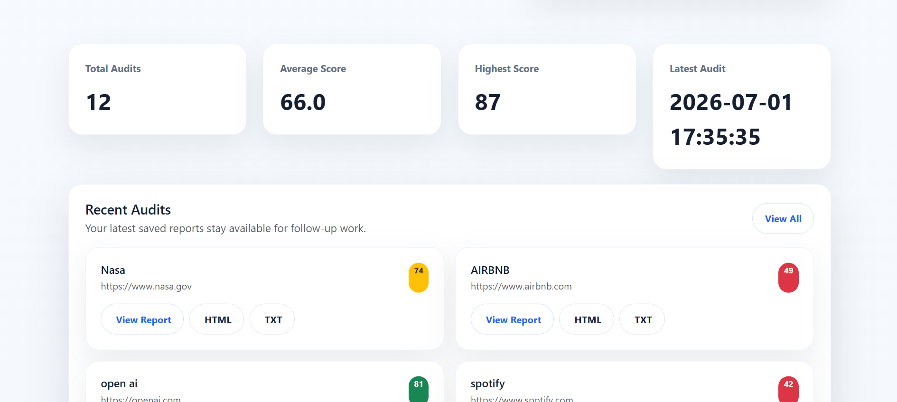

### Audit Dashboard
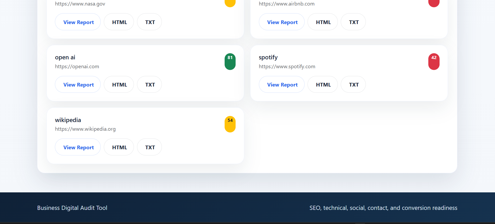

### Audit Results - Overview
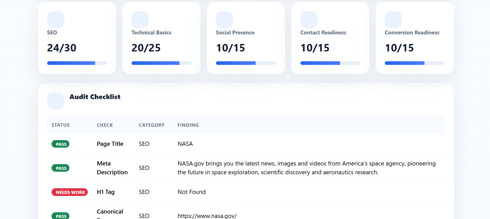

### Audit Results - Checklist
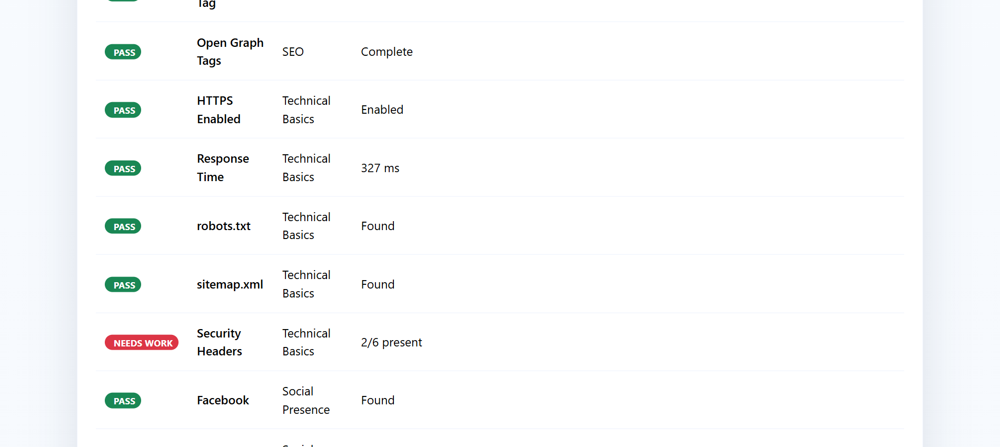

### Recommendations & Security Headers
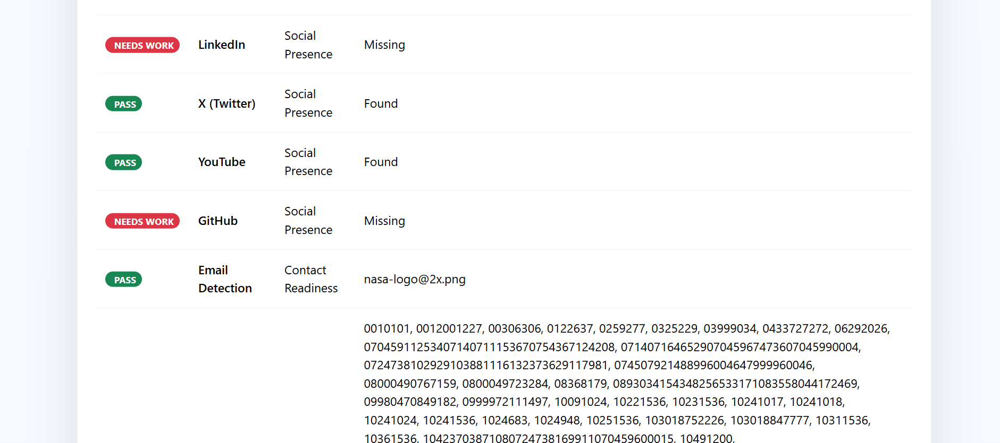

### WhatsApp Message & Action Panel
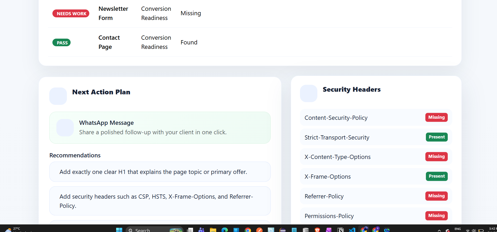

### Saved Audit History
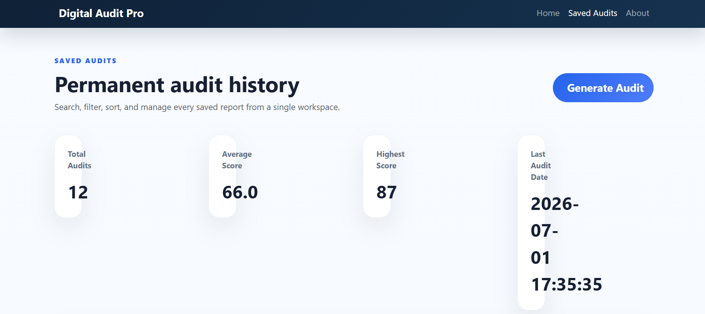

### Audit History Dashboard
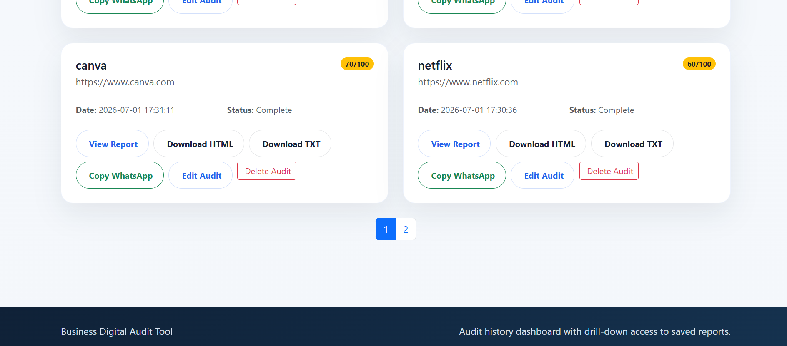

### First Audit Report
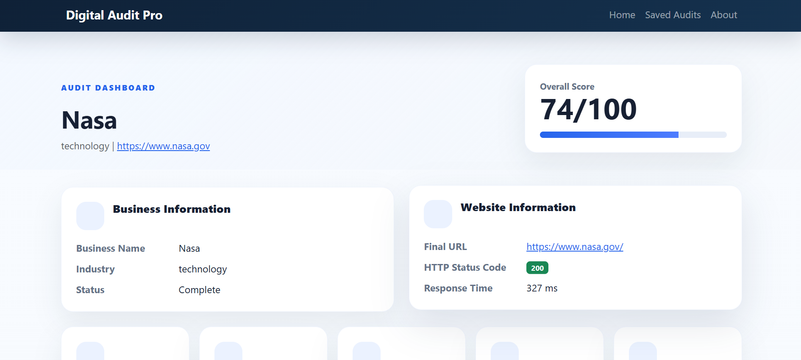

### History Last Section
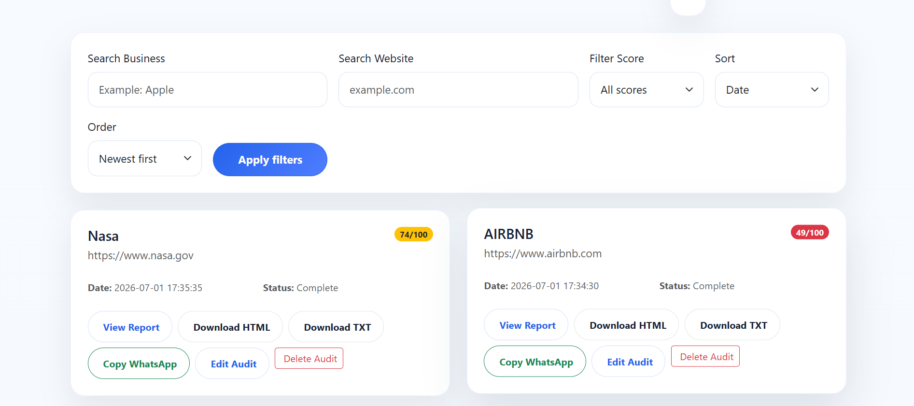

## Sample Output

```text
BUSINESS DIGITAL AUDIT REPORT
============================================================

Business Name : B Socio
Industry      : Digital Marketing
Website URL   : https://example.com
HTTP Status   : 200
Response Time : 384 ms
Overall Score : 78/100

CATEGORY SCORES
------------------------------------------------------------
SEO: 24/30
Technical Basics: 20/25
Social Presence: 6/15
Contact Readiness: 10/15
Conversion Readiness: 15/15
```

## Future Improvements

- Add database persistence for historical audits.
- Add user login and team workspaces.
- Add PDF export.
- Add Lighthouse/PageSpeed API integration.
- Add deeper crawl support for multi-page audits.
- Add charts for score trends over time.
- Add queue-based background processing for slow websites.

## License

This project is released under the MIT License. See `LICENSE` for details.
